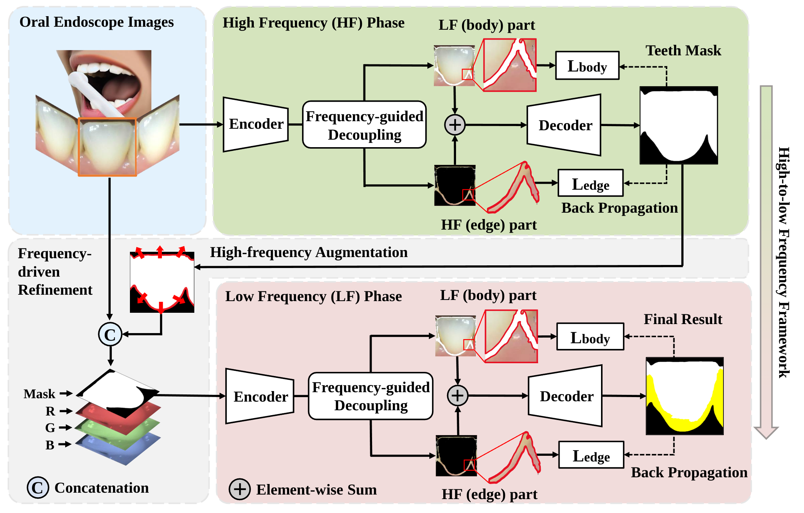

# Frequency-Guided Network
Official PyTorch implementation for the paper:

> **Frequency-Guided Network for Low-contrast Staining-free Dental Plaque Segmentation** [BIBM 2024]
>
> Yiming Jiang, Wenfeng Song\*, Shuai Li\*, Yuming Yang, Bin Xia, Aimin Hao, Xia Hou

<p align="center">

</p>


> In this paper, we propose a novel Frequency-Guided Network (FGN) for automatic staining-free plaque segmentation using raw oral endoscope images. We employ a frequency-guided decoupling module to separate the image into high-frequency and low-frequency regions automatically and expand the high-frequency region to encompass nearby potential dental plaque.


## **Environmental Preparation**

- Ubuntu (Linux)
- Python 3.7+
- Pytorch 1.6.0
- CUDA 10.2
- apex

Create environment:

```bash
conda env create -f FGN.yaml
```

Other necessary packages:
```bash
pip install -r FGN_requirements.txt
```


## Train&Evaluation
Download the pretrained models from [resnet50-deep.pth](https://pan.baidu.com/s/1MWzpkI3PwtnEl1LSOyLrLw) (with password 4lwf, offering by [DecoupleSegNet](https://github.com/lxtGH/DecoupleSegNets)).

Run the bash script in the ./script/train and ./script/evaluate_val directory according to your needs.

### HF-stage Training

```bash
sh ./scripts/train/train_teeth_no_plaque_ResNet50_deeplab_decouple.sh
```

### LF-stage Training

```bash
sh ./scripts/train/train_teeth_mask_ResNet50_deeplab_decouple.sh
```

### Evaluation

```bash
sh ./scripts/eval_teeth_mask_deeplab_r50_decouple.sh 
```

## **Citation**

If you find our code or paper useful, please consider citing：
```bibtex

```


## **Acknowledgement**
We heavily borrow the code from
[DecoupleSegNet](https://github.com/lxtGH/DecoupleSegNets).
Any third-party packages are owned by their respective authors and must be used under their respective licenses.
